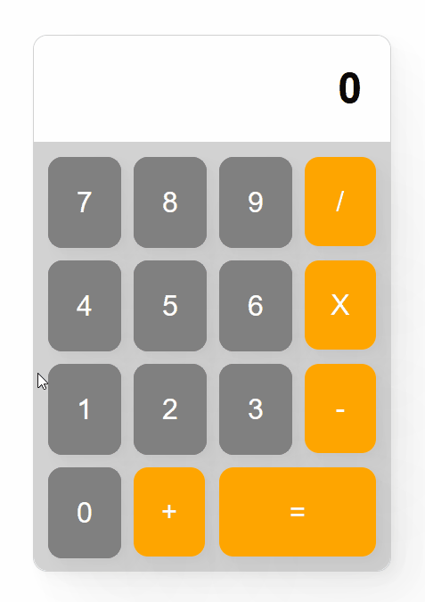

# Calculator 🖩

The calculator is made in [CSS Grid](https://developer.mozilla.org/en-US/docs/Web/CSS/CSS_Grid_Layout), and works with some [EventListeners](https://developer.mozilla.org/en-US/docs/Web/API/EventTarget/addEventListener) and the [eval() function](https://developer.mozilla.org/en-US/docs/Web/JavaScript/Reference/Global_Objects/eval).  

